# Pane Architecture Document

## Introduction

This document outlines the overall project architecture for Pane, including backend systems, shared services, and non-UI specific concerns. Its primary goal is to serve as the guiding architectural blueprint for AI-driven development, ensuring consistency and adherence to chosen patterns and technologies.

**Relationship to Frontend Architecture:**
If the project includes a significant user interface, a separate Frontend Architecture Document will detail the frontend-specific design and MUST be used in conjunction with this document. Core technology stack choices documented herein (see "Tech Stack") are definitive for the entire project, including any frontend components.

### Starter Template or Existing Project

**N/A** – This is a greenfield Rust project with no starter template. The project will be built from scratch using:
- Cargo as the build tool and package manager
- Standard Rust project structure
- Manual setup for all tooling and configuration based on Rust ecosystem best practices

### Change Log

| Date | Version | Description | Author |
|------|---------|-------------|--------|
| 2025-01-18 | 0.1.0 | Initial architecture document | Winston (Architect) |

## High Level Architecture

### Technical Summary

Pane employs a **single-binary TUI architecture** built in Rust for maximum performance and portability. The system uses an **event-driven monolith** pattern with a skill plugin system that enables external executables to be discovered, launched, and managed through a unified launcher interface. The architecture prioritizes **sub-100ms startup time** and **zero-dependency distribution** (single static binary). Core architectural patterns include a reactive event loop (powered by `crossterm` input polling), a modular widget system (`ratatui`), and a manifest-based plugin discovery mechanism. This design directly supports the PRD's goal of minimal context switching by keeping all interactions within the terminal pane while enabling a community-driven skill ecosystem through simple YAML manifests.

### High Level Overview

**Architectural Style:**
**Modular Monolith with Plugin System** – A single Rust binary that discovers and orchestrates external skill executables through a standardized manifest interface.

**Repository Structure:**
**Single Repository (Monorepo-lite)** – The core Pane application and the bundled Claude Code Tips Viewer skill will live in a single repository. Future skills may live in separate repositories but will follow the same manifest pattern.

**Service Architecture:**
**Single Process, Multi-Executable Model**
- Main process: Pane TUI launcher (Rust binary)
- Child processes: Skills (any language, spawned on-demand)
- Communication: Environment variables + optional stdin JSON

**Primary User Flow:**
1. User runs `pane` command
2. TUI launcher appears with skill search/list interface
3. User selects a skill (keyboard navigation)
4. Pane suspends its TUI and spawns the skill executable
5. Skill takes over terminal (TUI mode) or returns output (inline mode)
6. On skill exit, Pane restores launcher interface
7. Repeat or exit

**Key Architectural Decisions:**

| Decision | Rationale |
|----------|-----------|
| **Rust** | Sub-100ms startup, single binary distribution, memory safety, excellent TUI ecosystem |
| **Monolith with plugin pattern** | Simplicity for MVP, avoids network/IPC overhead, enables offline operation |
| **Manifest-based skill discovery** | Language-agnostic, low barrier for contributors, declarative over imperative |
| **Process suspension model** | Simplest way to hand terminal control to child skills, no complex IPC needed |
| **Three-tier skill discovery** | Project > User > System enables local overrides and dogfooding |

### High Level Project Diagram

```mermaid
graph TB
    User[👤 User] -->|runs 'pane'| Launcher[🖥️ Pane TUI Launcher]

    Launcher -->|discovers| SkillLoader[📂 Skill Loader]
    SkillLoader -->|scans| ProjectSkills[📁 .pane/skills/]
    SkillLoader -->|scans| UserSkills[📁 ~/.config/pane/skills/]
    SkillLoader -->|scans| SystemSkills[📁 /usr/local/share/pane/skills/]

    ProjectSkills -->|manifests| SkillRegistry[📋 Skill Registry]
    UserSkills -->|manifests| SkillRegistry
    SystemSkills -->|manifests| SkillRegistry

    Launcher -->|search/select| SkillRegistry
    Launcher -->|execute| SkillRunner[⚙️ Skill Runner]

    SkillRunner -->|spawn process| SkillExec[🎯 Skill Executable]
    SkillRunner -->|pass context| SkillExec

    SkillExec -->|TUI mode| Terminal[🖼️ Terminal]
    SkillExec -->|inline mode| Launcher

    SkillExec -->|exit| SkillRunner
    SkillRunner -->|restore| Launcher

    style Launcher fill:#4A90E2
    style SkillExec fill:#7ED321
    style SkillRegistry fill:#F5A623
```



### Architectural and Design Patterns

#### 1. Application Architecture Pattern: Event-Driven Monolith

- **Pattern:** Event-Driven Monolith – Single event loop handling input, state updates, rendering
- **Rationale:** Aligns with `ratatui` best practices. The main loop polls for terminal events (keypress, mouse, resize), updates application state, and re-renders the UI. No need for complex concurrency or distributed systems. Keeps startup time minimal and reduces dependency footprint.

#### 2. Plugin Discovery Pattern: Manifest-Based File System Scanning

- **Pattern:** Manifest-Based File System Scanning – Scan known directories for `pane-skill.yaml` files
- **Rationale:** Language-agnostic (skills can be written in any language), no network dependency, supports project/user/system scopes naturally through directory hierarchy. Simple YAML manifests keep contributor barrier low.

#### 3. Process Management Pattern: Fork-Exec with Terminal Handoff

- **Pattern:** Fork-Exec with Terminal Handoff – Suspend Pane TUI, spawn child, wait for exit
- **Rationale:** Simplest model for TUI skills that need full terminal control. Rust's `std::process::Command` handles this cleanly. Context passing via environment variables is standard Unix practice. For inline skills, stdout capture is trivial.

#### 4. State Management Pattern: Single Centralized AppState

- **Pattern:** Single Centralized AppState – One struct holding all UI state, passed mutably to handlers
- **Rationale:** Standard pattern for `ratatui` apps. Clean separation between state (AppState), view (UI rendering functions), and logic (event handlers). Simple to reason about, no async state management needed.

#### 5. Skill Execution Safety Pattern: Sandboxed Environment Variables

- **Pattern:** Sandboxed Environment Variables – Pass controlled context via `PANE_*` env vars
- **Rationale:** Skills run in the user's session but with predictable context (`PANE_CWD`, `PANE_GIT_ROOT`, etc.). This allows both simple shell scripts and complex applications to access context. Optional stdin JSON for structured data needs.

#### 6. Configuration Pattern: File-Based with Sensible Defaults

- **Pattern:** File-Based Config with Defaults – Optional `~/.config/pane/config.toml`
- **Rationale:** Standard XDG config location. TOML is human-editable and has excellent Rust support via `serde`. All settings optional—app works out-of-box with zero configuration.

## Tech Stack

### Cloud Infrastructure

**N/A** – Pane is a **local-only, offline-first terminal application**. No cloud services, databases, or external APIs are required for core functionality. All data (skills, config, favorites) is stored locally on the user's file system.

### Technology Stack Table

| Category | Technology | Version | Purpose | Rationale |
|----------|-----------|---------|---------|-----------|
| **Language** | Rust | 1.75+ (stable) | Primary development language | Memory safety, zero-cost abstractions, excellent TUI ecosystem, single binary compilation, <100ms startup achievable |
| **Build System** | Cargo | 1.75+ | Build tool and package manager | Standard Rust tooling, handles dependencies, testing, and compilation seamlessly |
| **TUI Framework** | `ratatui` | 0.26.0 | Terminal user interface framework | Active fork of `tui-rs`, excellent widget system, production-ready, strong community, PRD-specified |
| **Terminal Backend** | `crossterm` | 0.27.0 | Cross-platform terminal manipulation | Works on macOS/Linux/Windows, event-driven input handling, mouse support, PRD-specified |
| **Serialization** | `serde` | 1.0 | Serialization/deserialization framework | Industry standard for Rust, zero-cost abstractions, excellent derive macros |
| **YAML Parsing** | `serde_yaml` | 0.9.0 | Skill manifest parsing | Human-readable manifests, good error messages, serde integration |
| **TOML Parsing** | `toml` | 0.8.0 | Config file parsing | User-friendly config format, excellent Rust support, XDG standard |
| **Fuzzy Matching** | `nucleo` | 0.2.0 | Fuzzy search for skill filtering | Fastest fuzzy matcher in Rust ecosystem (used by Helix editor), beats `sublime_fuzzy` and `fuzzy-matcher` |
| **Process Management** | `std::process::Command` | stdlib | Skill execution | Built-in Rust standard library, no extra dependencies, Unix-native |
| **Error Handling** | `anyhow` | 1.0 | Application-level error handling | Context-rich errors, simple API, perfect for CLI applications |
| **CLI Parsing** | `clap` | 4.5.0 | Command-line argument parsing | Derive macros for `--help`, `--version`, future extensibility for debug flags |
| **Testing** | `cargo test` + `rstest` | 0.18.0 | Unit and integration testing | Native Rust testing with parametric tests via `rstest`, no need for heavy frameworks |
| **Logging** | `tracing` | 0.1 | Structured logging | Optional debug logging to file, minimal overhead when disabled, excellent performance |
| **Git Detection** | `git2` | 0.18.0 | Detect git root for context | Libgit2 bindings, reliable git repository detection for `PANE_GIT_ROOT` |
| **Code Formatting** | `rustfmt` | stdlib | Code formatting | Enforced in CI, ensures consistent code style |
| **Linting** | `clippy` | stdlib | Static analysis and linting | Catches common mistakes and enforces best practices |
| **Distribution** | Homebrew + Cargo | N/A | Package distribution | Primary: Homebrew for macOS/Linux; Secondary: `cargo install` for Rust users |
| **CI/CD** | GitHub Actions | N/A | Continuous integration | Free for open source, excellent Rust support, cross-platform builds |

## Data Models

### Skill

**Purpose:** Represents a discoverable skill with its manifest metadata and execution configuration.

**Key Attributes:**
- `id: String` – Unique identifier for the skill (e.g., "claude-tips")
- `name: String` – Human-readable display name (e.g., "Claude Code Tips")
- `description: String` – One or two sentence explanation of what the skill does
- `version: String` – Semantic version of the skill
- `exec: String` – Executable or script name/path to run
- `args: Vec<String>` – Command-line arguments to pass to the executable
- `tags: Vec<String>` – Searchable tags for filtering (e.g., ["tips", "claude", "coding"])
- `estimated_time: Option<String>` – Human-readable time estimate (e.g., "1–3 min")
- `ui_mode: UiMode` – Enum: `Tui` or `Inline`
- `ui_fullscreen: bool` – Whether skill uses fullscreen mode (default: true)
- `context_config: ContextConfig` – Which context fields to pass to the skill
- `source: SkillSource` – Enum: `System`, `User`, or `Project`
- `manifest_path: PathBuf` – Path to the source `pane-skill.yaml` file

**Relationships:**
- Owned by `SkillRegistry` collection
- Referenced by `AppState` for current selection
- Used by `SkillRunner` for execution

### AppState

**Purpose:** Central application state for the TUI launcher, managing UI state, loaded skills, and user interactions.

**Key Attributes:**
- `skills: Vec<Skill>` – All discovered skills after loading and deduplication
- `filtered_skills: Vec<usize>` – Indices into `skills` matching current search query
- `selected_index: usize` – Currently selected skill index in `filtered_skills`
- `search_query: String` – Current fuzzy search input
- `view_mode: ViewMode` – Enum: `All`, `Favorites`, `Recent`
- `favorites: HashSet<String>` – Skill IDs marked as favorites
- `recent: Vec<String>` – Recently executed skill IDs (ordered, most recent first)
- `config: Config` – User configuration loaded from TOML
- `should_quit: bool` – Flag to exit the application

**Relationships:**
- Contains collection of `Skill` objects
- References `Config` for user preferences
- Modified by input handlers and event loop
- Used by UI rendering functions

### Config

**Purpose:** User configuration loaded from `~/.config/pane/config.toml` with sensible defaults.

**Key Attributes:**
- `default_view_mode: ViewMode` – Default view on launch (All/Favorites/Recent)
- `enable_mouse: bool` – Whether to enable mouse support (default: true)
- `theme: Option<ThemeConfig>` – Optional theme customization (colors, styles)
- `max_recent_skills: usize` – Maximum number of recent skills to track (default: 10)
- `debug_log_enabled: bool` – Whether to enable debug logging to file (default: false)
- `debug_log_path: PathBuf` – Path to debug log file (default: `~/.config/pane/logs/pane-debug.log`)

**Relationships:**
- Loaded once at startup
- Owned by `AppState`
- Serialized/deserialized via `serde` + `toml`

### SkillContext

**Purpose:** Context data passed to skills via environment variables and optional stdin JSON.

**Key Attributes:**
- `skill_id: String` – ID of the skill being executed
- `skill_name: String` – Name of the skill
- `cwd: PathBuf` – Current working directory where `pane` was launched
- `git_root: Option<PathBuf>` – Git repository root (if detected)
- `project_name: Option<String>` – Project/repo name derived from git root or cwd
- `config_path: PathBuf` – Path to Pane's config file
- `args: Vec<String>` – Additional arguments passed to the skill

**Relationships:**
- Created by `SkillRunner` before skill execution
- Derived from `AppState` and system inspection (git detection)
- Passed to child process via `PANE_*` environment variables
- Optionally serialized to JSON and sent to skill's stdin

### Supporting Enums and Structs

**UiMode (Enum)** – Defines how a skill interacts with the terminal
- `Tui` – Skill takes over the terminal with its own TUI
- `Inline` – Skill prints to stdout, results embedded in launcher

**ViewMode (Enum)** – Defines which skills are displayed in the launcher list
- `All` – Show all discovered skills
- `Favorites` – Show only favorited skills
- `Recent` – Show only recently executed skills

**SkillSource (Enum)** – Indicates where a skill was discovered (for override precedence)
- `System` – Discovered in `/usr/local/share/pane/skills/`
- `User` – Discovered in `~/.config/pane/skills/`
- `Project` – Discovered in `./.pane/skills/`
- Precedence: Project > User > System (for ID collision resolution)

**ContextConfig (Struct)** – Configuration for which context fields to pass to a skill
- `pass_cwd: bool` – Whether to pass current working directory
- `pass_git_root: bool` – Whether to detect and pass git root
- `pass_project_name: bool` – Whether to pass project name
- `pass_stdin_json: bool` – Whether to send full context as JSON to stdin

## Components

### 1. App Orchestrator

**Responsibility:** Main application entry point and event loop orchestration. Manages the lifecycle of the TUI application, coordinates between input handling, state updates, and UI rendering.

**Key Interfaces:**
- `fn main() -> Result<()>` – Application entry point, CLI argument parsing
- `fn run(config: Config) -> Result<()>` – Main event loop initialization and execution
- `fn handle_event(state: &mut AppState, event: Event) -> Result<()>` – Event dispatch to appropriate handlers

**Dependencies:** Input Handler, UI Renderer, Skill Loader, Config Loader

**Technology Stack:** `clap`, `crossterm`, `ratatui`, `anyhow`

### 2. Skill Loader

**Responsibility:** Discover, parse, and validate skill manifests from the three-tier directory hierarchy (Project > User > System). Handle ID collision resolution and manifest validation.

**Key Interfaces:**
- `fn discover_skills() -> Result<Vec<Skill>>` – Scan all skill directories and parse manifests
- `fn load_manifest(path: PathBuf) -> Result<Skill>` – Parse a single `pane-skill.yaml` file
- `fn deduplicate_skills(skills: Vec<Skill>) -> Vec<Skill>` – Apply precedence rules for ID collisions
- `fn validate_skill(skill: &Skill) -> Result<()>` – Validate required fields and executable existence

**Dependencies:** File system, Git Detector

**Technology Stack:** `serde_yaml`, `serde`, `git2`, `anyhow`

### 3. Skill Runner

**Responsibility:** Execute skills as child processes, manage terminal handoff, pass context via environment variables and stdin, handle process lifecycle.

**Key Interfaces:**
- `fn execute_skill(skill: &Skill, context: SkillContext) -> Result<ExitStatus>` – Spawn and wait for skill process
- `fn prepare_environment(context: &SkillContext) -> HashMap<String, String>` – Build `PANE_*` environment variables
- `fn suspend_tui() -> Result<()>` – Temporarily disable Pane's TUI for skill execution
- `fn restore_tui() -> Result<()>` – Reinitialize TUI after skill exits

**Dependencies:** App State, Git Detector

**Technology Stack:** `std::process::Command`, `std::env`, `serde_json`, `crossterm`

### 4. UI Renderer

**Responsibility:** Render the TUI launcher interface using `ratatui`. Display skill list, search bar, detail pane, and footer with key hints. Handle responsive layout and theme application.

**Key Interfaces:**
- `fn render(frame: &mut Frame, state: &AppState)` – Main rendering function called each frame
- `fn render_header(area: Rect, frame: &mut Frame)` – Render title and subtitle
- `fn render_search_bar(area: Rect, frame: &mut Frame, query: &str)` – Render search input
- `fn render_skill_list(area: Rect, frame: &mut Frame, skills: &[Skill], selected: usize)` – Render scrollable skill list
- `fn render_detail_pane(area: Rect, frame: &mut Frame, skill: &Skill)` – Render selected skill details
- `fn render_footer(area: Rect, frame: &mut Frame)` – Render key hints

**Dependencies:** App State, Theme Config

**Technology Stack:** `ratatui` (widgets, layout, styling)

### 5. Input Handler

**Responsibility:** Process keyboard and mouse input events, update application state, trigger fuzzy search filtering, manage view mode switching.

**Key Interfaces:**
- `fn handle_key_event(state: &mut AppState, key: KeyEvent) -> Result<Action>` – Process keyboard input
- `fn handle_mouse_event(state: &mut AppState, mouse: MouseEvent) -> Result<Action>` – Process mouse input
- `fn update_search_query(state: &mut AppState, query: String)` – Update search and trigger filtering
- `fn update_selection(state: &mut AppState, direction: Direction)` – Move selection up/down
- `fn toggle_favorite(state: &mut AppState)` – Add/remove current skill from favorites

**Dependencies:** Fuzzy Matcher, App State

**Technology Stack:** `crossterm::event`, `nucleo`

### 6. Fuzzy Matcher

**Responsibility:** Perform fast fuzzy matching of search queries against skill names, IDs, tags, and descriptions. Provide ranked results.

**Key Interfaces:**
- `fn filter_skills(query: &str, skills: &[Skill]) -> Vec<usize>` – Return indices of matching skills, ranked by score
- `fn score_skill(query: &str, skill: &Skill) -> Option<i64>` – Calculate match score for a single skill

**Dependencies:** Skill data models

**Technology Stack:** `nucleo`

### 7. Config Loader

**Responsibility:** Load and parse user configuration from `~/.config/pane/config.toml`. Provide sensible defaults for missing or invalid values. Persist favorites and recent skills.

**Key Interfaces:**
- `fn load_config() -> Result<Config>` – Load config from standard location with defaults
- `fn save_config(config: &Config) -> Result<()>` – Persist config to disk
- `fn default_config() -> Config` – Return default configuration

**Dependencies:** File system

**Technology Stack:** `toml`, `serde`, XDG Base Directory spec

### 8. Git Detector (Context Provider)

**Responsibility:** Detect git repository root from current working directory. Extract project name from repository path.

**Key Interfaces:**
- `fn detect_git_root(cwd: &Path) -> Option<PathBuf>` – Find git root by walking up directory tree
- `fn extract_project_name(git_root: &Path) -> Option<String>` – Get repository/folder name

**Dependencies:** None

**Technology Stack:** `git2::Repository`, `std::path`

### 9. Logger

**Responsibility:** Provide optional structured logging to file for debugging. Minimal overhead when disabled.

**Key Interfaces:**
- `fn init_logger(config: &Config) -> Result<()>` – Initialize tracing subscriber if debug enabled
- `fn log_event(level: Level, message: &str, context: impl Serialize)` – Log structured event

**Dependencies:** Config

**Technology Stack:** `tracing`, `tracing-subscriber`

### Component Interaction Diagram


## Core Workflows

### Workflow 1: Application Startup & Skill Discovery


### Workflow 2: User Search & Skill Selection


### Workflow 3: Skill Execution & Terminal Handoff


### Workflow 4: Favorite Management & View Switching


## External APIs

**N/A** – Pane is a local-only, offline-first terminal application with no external API integrations required for core functionality. All data is stored locally on the user's file system.

**Future Consideration:** In Phase 3 (Community & Integrations), a git-based skill registry pattern may be introduced, but this would be optional and not part of the core architecture.

## Database Schema

**N/A** – Pane does not use a traditional relational or NoSQL database. All persistent data is stored in human-editable text files for simplicity, transparency, and zero-dependency operation.

### Data Storage Strategy

**Configuration Data (`~/.config/pane/config.toml`)** - Stores user preferences, favorites, and recent skills list using TOML format

**Skill Manifests (`pane-skill.yaml`)** - Each skill has its own manifest file in YAML format

### Rationale for File-Based Storage

**Advantages:**
- Human-editable with any text editor
- Version control friendly (plain text)
- Zero database dependencies
- Transparent data storage
- Portable and easy to backup

**Trade-offs:**
- No query capabilities (acceptable for <1000 skills)
- No atomic transactions (mitigated by temp file + rename pattern)
- Parse overhead on load (acceptable for small files <100KB)

**Scaling Considerations:** If skill ecosystem grows beyond ~1000 skills, SQLite may be introduced for skill metadata indexing while keeping TOML/YAML for config and manifests.

## Source Tree

```
pane/
├── .github/
│   └── workflows/
│       ├── ci.yml                  # GitHub Actions CI pipeline
│       ├── release.yml             # Automated releases with binaries
│       └── security-audit.yml      # Dependency vulnerability scanning
│
├── src/
│   ├── main.rs                     # Application entry point, CLI parsing
│   ├── app.rs                      # App Orchestrator - event loop & state management
│   │
│   ├── skills/
│   │   ├── mod.rs                  # Skills module exports
│   │   ├── loader.rs               # Skill Loader - discovery & parsing
│   │   ├── runner.rs               # Skill Runner - execution & terminal handoff
│   │   ├── model.rs                # Skill, SkillSource, UiMode, ContextConfig types
│   │   └── manifest.rs             # YAML manifest parsing logic
│   │
│   ├── ui/
│   │   ├── mod.rs                  # UI module exports
│   │   ├── renderer.rs             # UI Renderer - main render function
│   │   ├── components/
│   │   │   ├── mod.rs
│   │   │   ├── header.rs           # Header component (title, subtitle)
│   │   │   ├── search_bar.rs       # Search input component
│   │   │   ├── skill_list.rs       # Scrollable skill list component
│   │   │   ├── detail_pane.rs      # Skill detail viewer component
│   │   │   └── footer.rs           # Key hints footer component
│   │   └── theme.rs                # Theme and styling configuration
│   │
│   ├── input.rs                    # Input Handler - keyboard & mouse events
│   ├── search.rs                   # Fuzzy Matcher - nucleo integration
│   ├── state.rs                    # AppState, ViewMode enums
│   ├── config.rs                   # Config Loader - TOML parsing & persistence
│   ├── context.rs                  # SkillContext - git detection & context gathering
│   ├── logging.rs                  # Logger - tracing setup
│   └── error.rs                    # Custom error types and Result aliases
│
├── skills/
│   └── claude-tips/                # Bundled Claude Code Tips Viewer skill
│       ├── pane-skill.yaml         # Skill manifest
│       ├── Cargo.toml              # Skill's own Rust project
│       ├── src/
│       │   └── main.rs             # Tips viewer TUI implementation
│       └── data/
│           └── claude-tips.yaml    # Tips content database
│
├── tests/
│   ├── integration/
│   │   ├── mod.rs
│   │   ├── skill_discovery_test.rs # Test three-tier skill loading
│   │   ├── search_test.rs          # Test fuzzy matching
│   │   └── config_test.rs          # Test config loading & persistence
│   │
│   └── fixtures/
│       ├── skills/                 # Sample skill manifests for testing
│       └── configs/                # Sample config files for testing
│
├── examples/
│   ├── simple-skill.sh             # Example bash skill
│   ├── python-skill/               # Example Python skill
│   │   ├── pane-skill.yaml
│   │   └── main.py
│   └── rust-skill-template/        # cargo-generate template for Rust skills
│       ├── pane-skill.yaml
│       └── Cargo.toml
│
├── docs/
│   ├── prd.md                      # Product Requirements Document
│   ├── architecture.md             # This architecture document
│   └── skill-development-guide.md  # How to create skills (Phase 2)
│
├── scripts/
│   ├── install.sh                  # Installation script
│   ├── uninstall.sh                # Uninstallation script
│   └── build-release.sh            # Build optimized release binary
│
├── .cargo/
│   └── config.toml                 # Cargo build configuration (optimization flags)
│
├── Cargo.toml                      # Project dependencies & metadata
├── Cargo.lock                      # Locked dependency versions
├── rust-toolchain.toml             # Rust version specification
├── .gitignore                      # Git ignore patterns
├── LICENSE                         # MIT or Apache 2.0
├── README.md                       # Project overview & quick start
└── CHANGELOG.md                    # Version history
```

## Infrastructure and Deployment

### Infrastructure as Code

**N/A** – Pane is a local CLI application with no cloud infrastructure requirements. There are no servers, databases, or cloud services to provision.

### Deployment Strategy

**Strategy:** Binary Distribution with Package Managers

**Primary Distribution:** Homebrew (macOS/Linux) - Homebrew tap for easy installation and updates

**Secondary Distribution:** Cargo (Rust developers) - Direct installation via `cargo install pane`

**Tertiary Distribution:** GitHub Releases (Universal) - Pre-built binaries for major platforms

**CI/CD Platform:** GitHub Actions

### Environments

- **Development** – Local developer machines running `cargo run`
- **Staging** – CI/CD environment running integration tests before release
- **Production** – End-user machines running installed binary

### Environment Promotion Flow

```
Developer Commit
    ↓
GitHub Actions CI
    ├─ Run tests (unit + integration)
    ├─ Run clippy linter
    ├─ Run security audit (cargo audit)
    └─ Build debug binary
    ↓
PR Merge to main
    ↓
GitHub Actions Release (on version tag)
    ├─ Build release binaries (macOS x86_64, macOS ARM64, Linux x86_64)
    ├─ Strip symbols and optimize
    ├─ Run smoke tests on binaries
    ├─ Create GitHub Release with binaries
    ├─ Publish to crates.io
    └─ Update Homebrew tap
    ↓
User Installation
    ├─ brew install pane (Homebrew)
    ├─ cargo install pane (Cargo)
    └─ Manual download from GitHub Releases
```

### Rollback Strategy

**Primary Method:** Version pinning and downgrade

**Trigger Conditions:**
- Critical bug reports within 24 hours of release
- Security vulnerability discovered in release
- Binary compatibility issues on major platforms

**Recovery Time Objective (RTO):** <4 hours for critical issues

## Error Handling Strategy

### General Approach

**Error Model:** Result-based error handling with `anyhow` for application code

**Exception Hierarchy:**
- **Application Errors** (`anyhow::Error`) - Main error type for user-facing errors
- **Component-Specific Errors** - Custom error types where needed (e.g., `SkillLoadError`, `ConfigError`)
- **Library Errors** - Errors from dependencies, wrapped with context

**Error Propagation:**
- Use `?` operator for automatic propagation with context
- Add `.context()` or `.with_context()` for rich error messages
- Display user-friendly error messages, log technical details

### Logging Standards

**Library:** `tracing` 0.1

**Format:** Structured JSON logging (when enabled)

**Levels:** ERROR (critical failures), WARN (recoverable issues), INFO (state changes), DEBUG (detailed flow), TRACE (verbose)

**Required Context:**
- **Correlation ID:** Generated per-session UUID for tracing related logs
- **Service Context:** Component name (e.g., "skill_loader", "ui_renderer")
- **User Context:** Never log personally identifiable information

**Log Output:**
- **Production:** File-based logging to `~/.config/pane/logs/pane-debug.log` (opt-in via config)
- **Development:** stdout with pretty-printing
- **Disabled by Default:** Zero overhead when logging is off

### Error Handling Patterns

#### Skill Discovery and Loading Errors

**Scenario:** Skill manifest not found, invalid YAML, missing required fields

**Retry Policy:** No retry - skip skill and continue discovery

**Error Translation:** Log warning, skip individual skill failures, continue loading other skills

**User-Facing Error:** "Some skills could not be loaded. Run with `PANE_DEBUG=1` for details."

#### Skill Execution Errors

**Scenario:** Executable not found, execution fails, timeout

**Retry Policy:** No automatic retry - return to launcher with error message

**Timeout Configuration:** No timeout for MVP (skills are user-trusted)

**User-Facing Error:** Toast notification in launcher: "Failed to run '{skill.name}': executable not found"

#### Configuration Errors

**Scenario:** Config file corrupted, invalid TOML, permission denied

**Retry Policy:** Fallback to default configuration

**User-Facing Error:** "Config file corrupted, using defaults. Check `~/.config/pane/config.toml`"

#### Terminal Handoff Errors

**Scenario:** Failed to suspend/restore TUI, terminal state corrupted

**Retry Policy:** Attempt restore once, then exit gracefully

**Compensation Logic:** TerminalGuard RAII pattern ensures terminal restore even on panic

**User-Facing Error:** "Terminal handoff failed. Please restart your terminal."

#### Git Detection Errors

**Scenario:** Git repository detection fails, libgit2 errors

**Retry Policy:** No retry - gracefully degrade, continue without git context

**User-Facing Error:** None - silently degrades, git context not passed to skill

### Data Consistency

**Transaction Strategy:** Atomic file writes using temp file + rename pattern

**Compensation Logic:** If save fails, old config remains untouched

**Idempotency:** Config saves are idempotent - safe to retry

### Error Codes

**Exit Codes:** Unix conventions
- **0** - Success
- **1** - General application error
- **2** - CLI argument parsing error
- **64** - Skill not found
- **65** - Config error
- **70** - Internal error (bug)

## Coding Standards

### Core Standards

**Languages & Runtimes:**
- Rust 1.75+ (stable channel only)
- Edition 2021
- Toolchain managed via `rust-toolchain.toml`

**Style & Linting:**
- Formatter: `rustfmt` with default settings (enforced in CI)
- Linter: `clippy` with `-D warnings` (treat all warnings as errors)
- Line Length: 100 characters
- Imports: Grouped as std, external crates, crate modules

**Test Organization:**
- Unit tests co-located with modules using `#[cfg(test)] mod tests { ... }`
- Integration tests in separate `tests/` directory
- Test naming: `test_<function>_<scenario>_<expected_outcome>`
- Fixtures stored in `tests/fixtures/`

### Critical Rules

**MANDATORY rules that AI agents must follow:**

**1. Never use `unwrap()` or `expect()` in application code**
- Always use `?` operator or explicit error handling with `match`
- Exception: Only in tests where panic is intentional
- CLI applications must never panic on user input or runtime conditions

**2. All public functions must have doc comments**
- Use `///` doc comments explaining purpose, parameters, return values, and errors
- Format: Summary sentence, then details, then examples if complex

**3. Use `anyhow::Result<T>` for all fallible functions**
- Never use bare `Result<T, E>` in application code
- Consistent error handling and rich context propagation

**4. All state mutations must be explicit and documented**
- `AppState` modifications must happen through clearly named methods, not direct field access
- Predictable state changes, easier debugging and testing

**5. Never log sensitive information**
- Do not log file contents, environment variables (except `PANE_*`), or full user paths
- Privacy and security first

**6. Terminal state must be managed with RAII guards**
- Use guard structs that implement `Drop` for terminal mode changes
- Ensures terminal restoration even on panic or early return

**7. Use structured bindings, avoid tuple indices**
- When pattern matching or destructuring, use named bindings
- Clarity and resistance to field order changes

**8. Skill execution must validate executables exist before spawning**
- Check `skill.exec` is in PATH or is valid absolute path before `Command::new()`
- Better error messages than "file not found" after spawn

### Language-Specific Guidelines

**Rust Idioms:**
- Prefer `impl Trait` over generic type parameters for return types when possible
- Use `#[derive]` macros for common traits (`Debug`, `Clone`, `PartialEq`)
- Leverage type system: use `newtype` pattern for domain concepts
- Prefer iterators over explicit loops where readable
- Use `const` for compile-time constants, not `static`

**Async/Await:**
- Not used in MVP - Pane is synchronous by design
- If future versions need async: use `tokio` runtime, document clearly

## Test Strategy and Standards

### Testing Philosophy

**Approach:** Test-Driven Development (TDD) encouraged but not mandatory

**Coverage Goals:**
- Unit Tests: ≥80% code coverage for core logic
- Integration Tests: ≥70% coverage of critical user workflows
- End-to-End Tests: Manual for MVP, automated in Phase 2

**Test Pyramid:**
- 70% Unit Tests - Fast, isolated, comprehensive coverage
- 20% Integration Tests - Component interactions
- 10% E2E Tests - Complete user journeys

### Test Types and Organization

#### Unit Tests

**Framework:** `cargo test` + `rstest` 0.18.0 for parametric tests

**File Convention:** Co-located with source files using `#[cfg(test)] mod tests { ... }`

**Location:** Same file as the code being tested

**Mocking Library:** `mockall` 0.12.0 for mocking traits (where needed)

**Coverage Requirement:** ≥80% for core modules

**AI Agent Requirements:**
- Generate tests for all public methods
- Cover edge cases and error paths
- Follow AAA pattern (Arrange, Act, Assert)
- Mock all external dependencies

#### Integration Tests

**Scope:** Test interactions between multiple components

**Location:** `tests/integration/` directory

**Test Infrastructure:**
- File System: Use `tempfile` crate for temporary test directories
- Git Repositories: Use `git2` to create temporary git repos
- Config Files: Use fixtures in `tests/fixtures/configs/`

#### End-to-End Tests

**Framework:** Manual testing for MVP

**Scope:** Complete user workflows from `pane` command to skill execution and return

**Environment:** Actual terminal environment with real skill executables

**Test Data:** Use bundled Claude Code Tips Viewer skill as primary E2E test target

### Test Data Management

**Strategy:** Fixtures with version control

**Fixtures Location:** `tests/fixtures/`

**Structure:**
```
tests/fixtures/
├── skills/          # Valid and invalid skill manifests
├── configs/         # Config file variations
└── tips/            # Sample tips data
```

**Factories:** Use builder pattern for creating test data programmatically

**Cleanup Strategy:**
- Unit tests: No cleanup needed (in-memory)
- Integration tests: `tempfile::TempDir` auto-cleanup via `Drop`
- E2E tests: Manual cleanup or temporary user directories

### Continuous Testing

**CI Integration:**
- On every PR: Run all unit and integration tests
- On merge to main: Run full test suite + coverage report
- On release tag: Run smoke tests on built binaries

**Performance Tests:** Not in MVP, consider in Phase 2

**Security Tests:**
- `cargo audit` in CI (weekly + on every release)
- Dependency vulnerability scanning via GitHub Dependabot

## Security

### Input Validation

**Validation Library:** Native Rust type system + `serde` validation

**Validation Location:** At API boundaries (CLI parsing, manifest loading, config loading)

**Required Rules:**
- All external inputs MUST be validated
- Validation at parsing time before any processing
- Whitelist approach preferred over blacklist

**Specific Validations:**
1. **Skill Manifest Fields:**
   - `id`: Alphanumeric + hyphens only, max 64 chars
   - `exec`: Must not contain shell metacharacters (`;`, `|`, `&`, etc.)
   - `args`: Array of strings, no shell expansion
   - `tags`: Lowercase alphanumeric + hyphens, max 32 chars each

2. **Config File:**
   - `max_recent_skills`: 1-100 range
   - File paths: Valid UTF-8, no null bytes
   - Favorites/recent: Skill IDs validated against loaded skills

3. **User Input (Search Query):**
   - Max 256 characters
   - UTF-8 validation

### Authentication & Authorization

**N/A** - Local-only application, no authentication required

**Required Patterns:**
- Skills execute with user's permissions (no privilege escalation)
- File system permissions enforced by OS

### Secrets Management

**Development:** No secrets in code or config

**Production:** N/A - No external services requiring secrets

**Code Requirements:**
- NEVER hardcode paths to sensitive files (`~/.ssh/`, `~/.aws/`, etc.)
- No secrets in logs or error messages
- Environment variables sandboxed (only `PANE_*` passed)

### API Security

**N/A** - No HTTP server or IPC endpoints

### Data Protection

**Encryption at Rest:** Not required - config and manifests contain no sensitive data

**Encryption in Transit:** N/A - Local-only application

**PII Handling:**
- No PII collection
- User paths logged as basenames only
- Git context is project-related only

**Logging Restrictions:**
- Never log: File contents, environment variables (except `PANE_*`), full user paths, skill output
- Safe to log: Skill IDs, skill names, error types, component names, correlation IDs

### Dependency Security

**Scanning Tool:** `cargo audit` (integrated in CI)

**Update Policy:**
- Critical vulnerabilities: Patch within 24 hours, release hotfix
- High severity: Patch within 7 days, include in next release
- Medium/Low: Patch in regular release cycle

**Approval Process:**
- New dependencies require architectural review
- Check crates.io for download count (>100K preferred), recent updates (<6 months), license compatibility
- Avoid dependencies with security issues or abandoned maintenance

### Security Testing

**SAST Tool:** `cargo clippy` with security lints enabled

**DAST Tool:** Not applicable

**Penetration Testing:** Not required for MVP

**Security Review Checklist:**
- No `unsafe` code blocks (except in well-justified, audited cases)
- No shell command injection vectors
- Input validation at all boundaries
- Error messages don't leak sensitive information
- Dependencies scanned with `cargo audit`
- File operations use canonical paths (no symlink attacks)
