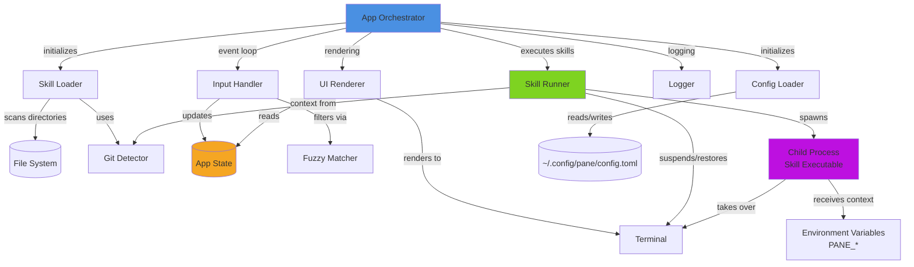

# Components

## 1. App Orchestrator

**Responsibility:** Main application entry point and event loop orchestration. Manages the lifecycle of the TUI application, coordinates between input handling, state updates, and UI rendering.

**Key Interfaces:**
- `fn main() -> Result<()>` – Application entry point, CLI argument parsing
- `fn run(config: Config) -> Result<()>` – Main event loop initialization and execution
- `fn handle_event(state: &mut AppState, event: Event) -> Result<()>` – Event dispatch to appropriate handlers

**Dependencies:** Input Handler, UI Renderer, Skill Loader, Config Loader

**Technology Stack:** `clap`, `crossterm`, `ratatui`, `anyhow`

## 2. Skill Loader

**Responsibility:** Discover, parse, and validate skill manifests from the three-tier directory hierarchy (Project > User > System). Handle ID collision resolution and manifest validation.

**Key Interfaces:**
- `fn discover_skills() -> Result<Vec<Skill>>` – Scan all skill directories and parse manifests
- `fn load_manifest(path: PathBuf) -> Result<Skill>` – Parse a single `pane-skill.yaml` file
- `fn deduplicate_skills(skills: Vec<Skill>) -> Vec<Skill>` – Apply precedence rules for ID collisions
- `fn validate_skill(skill: &Skill) -> Result<()>` – Validate required fields and executable existence

**Dependencies:** File system, Git Detector

**Technology Stack:** `serde_yaml`, `serde`, `git2`, `anyhow`

## 3. Skill Runner

**Responsibility:** Execute skills as child processes, manage terminal handoff, pass context via environment variables and stdin, handle process lifecycle.

**Key Interfaces:**
- `fn execute_skill(skill: &Skill, context: SkillContext) -> Result<ExitStatus>` – Spawn and wait for skill process
- `fn prepare_environment(context: &SkillContext) -> HashMap<String, String>` – Build `PANE_*` environment variables
- `fn suspend_tui() -> Result<()>` – Temporarily disable Pane's TUI for skill execution
- `fn restore_tui() -> Result<()>` – Reinitialize TUI after skill exits

**Dependencies:** App State, Git Detector

**Technology Stack:** `std::process::Command`, `std::env`, `serde_json`, `crossterm`

## 4. UI Renderer

**Responsibility:** Render the TUI launcher interface using `ratatui`. Display skill list, search bar, detail pane, and footer with key hints. Handle responsive layout and theme application.

**Key Interfaces:**
- `fn render(frame: &mut Frame, state: &AppState)` – Main rendering function called each frame
- `fn render_header(area: Rect, frame: &mut Frame)` – Render title and subtitle
- `fn render_search_bar(area: Rect, frame: &mut Frame, query: &str)` – Render search input
- `fn render_skill_list(area: Rect, frame: &mut Frame, skills: &[Skill], selected: usize)` – Render scrollable skill list
- `fn render_detail_pane(area: Rect, frame: &mut Frame, skill: &Skill)` – Render selected skill details
- `fn render_footer(area: Rect, frame: &mut Frame)` – Render key hints

**Dependencies:** App State, Theme Config

**Technology Stack:** `ratatui` (widgets, layout, styling)

## 5. Input Handler

**Responsibility:** Process keyboard and mouse input events, update application state, trigger fuzzy search filtering, manage view mode switching.

**Key Interfaces:**
- `fn handle_key_event(state: &mut AppState, key: KeyEvent) -> Result<Action>` – Process keyboard input
- `fn handle_mouse_event(state: &mut AppState, mouse: MouseEvent) -> Result<Action>` – Process mouse input
- `fn update_search_query(state: &mut AppState, query: String)` – Update search and trigger filtering
- `fn update_selection(state: &mut AppState, direction: Direction)` – Move selection up/down
- `fn toggle_favorite(state: &mut AppState)` – Add/remove current skill from favorites

**Dependencies:** Fuzzy Matcher, App State

**Technology Stack:** `crossterm::event`, `nucleo`

## 6. Fuzzy Matcher

**Responsibility:** Perform fast fuzzy matching of search queries against skill names, IDs, tags, and descriptions. Provide ranked results.

**Key Interfaces:**
- `fn filter_skills(query: &str, skills: &[Skill]) -> Vec<usize>` – Return indices of matching skills, ranked by score
- `fn score_skill(query: &str, skill: &Skill) -> Option<i64>` – Calculate match score for a single skill

**Dependencies:** Skill data models

**Technology Stack:** `nucleo`

## 7. Config Loader

**Responsibility:** Load and parse user configuration from `~/.config/pane/config.toml`. Provide sensible defaults for missing or invalid values. Persist favorites and recent skills.

**Key Interfaces:**
- `fn load_config() -> Result<Config>` – Load config from standard location with defaults
- `fn save_config(config: &Config) -> Result<()>` – Persist config to disk
- `fn default_config() -> Config` – Return default configuration

**Dependencies:** File system

**Technology Stack:** `toml`, `serde`, XDG Base Directory spec

## 8. Git Detector (Context Provider)

**Responsibility:** Detect git repository root from current working directory. Extract project name from repository path.

**Key Interfaces:**
- `fn detect_git_root(cwd: &Path) -> Option<PathBuf>` – Find git root by walking up directory tree
- `fn extract_project_name(git_root: &Path) -> Option<String>` – Get repository/folder name

**Dependencies:** None

**Technology Stack:** `git2::Repository`, `std::path`

## 9. Logger

**Responsibility:** Provide optional structured logging to file for debugging. Minimal overhead when disabled.

**Key Interfaces:**
- `fn init_logger(config: &Config) -> Result<()>` – Initialize tracing subscriber if debug enabled
- `fn log_event(level: Level, message: &str, context: impl Serialize)` – Log structured event

**Dependencies:** Config

**Technology Stack:** `tracing`, `tracing-subscriber`

## Component Interaction Diagram

