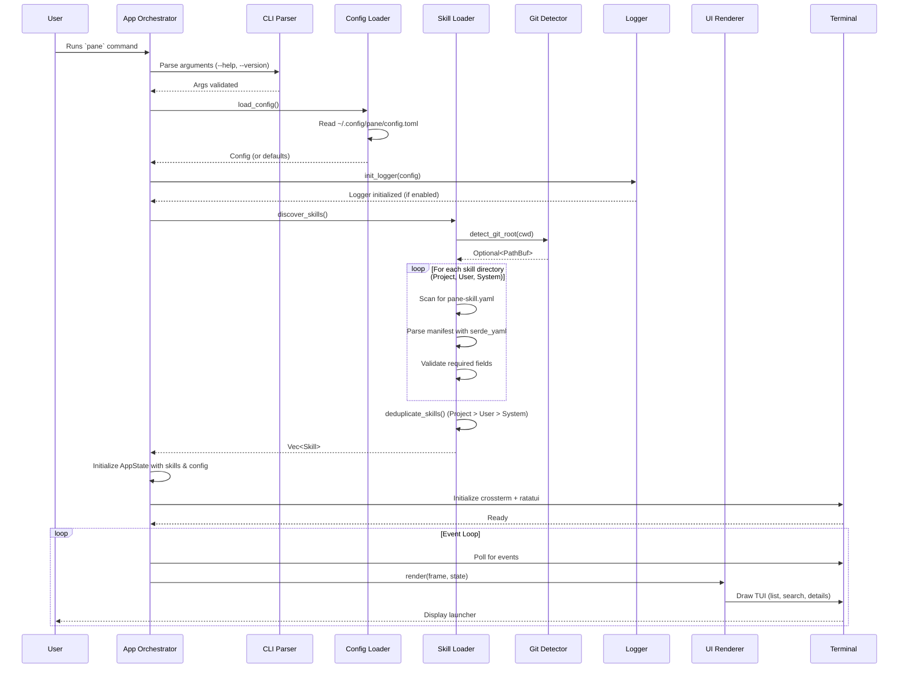
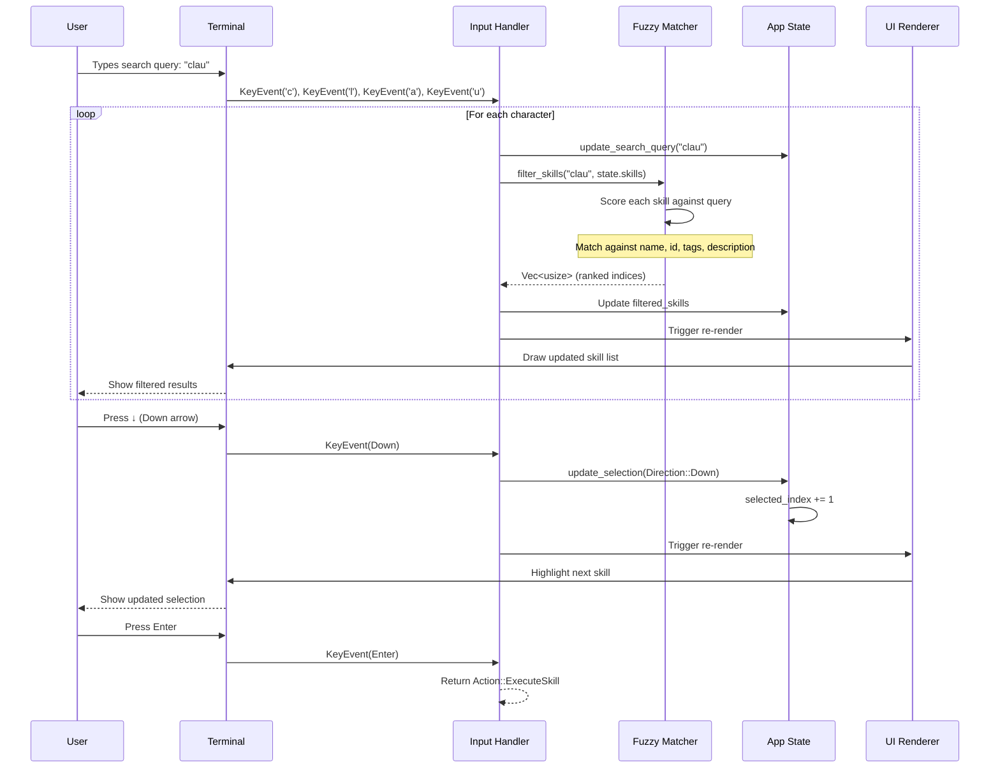
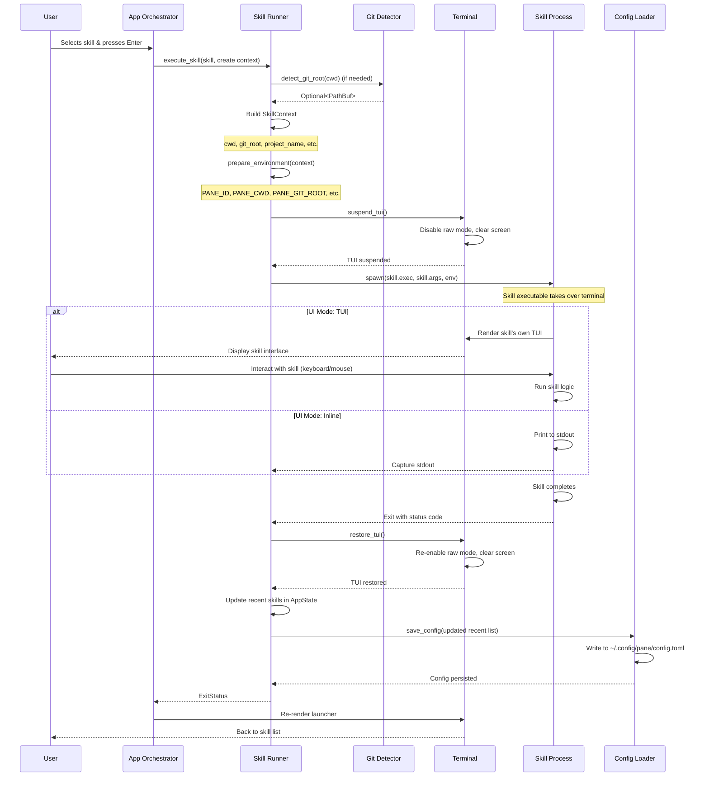
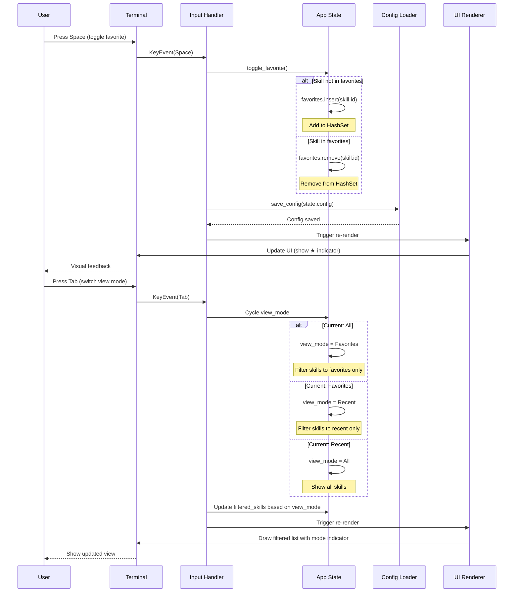

# Core Workflows

## Workflow 1: Application Startup & Skill Discovery

## Workflow 2: User Search & Skill Selection

## Workflow 3: Skill Execution & Terminal Handoff

## Workflow 4: Favorite Management & View Switching

