# High Level Architecture

## Technical Summary

Pane employs a **single-binary TUI architecture** built in Rust for maximum performance and portability. The system uses an **event-driven monolith** pattern with a skill plugin system that enables external executables to be discovered, launched, and managed through a unified launcher interface. The architecture prioritizes **sub-100ms startup time** and **zero-dependency distribution** (single static binary). Core architectural patterns include a reactive event loop (powered by `crossterm` input polling), a modular widget system (`ratatui`), and a manifest-based plugin discovery mechanism. This design directly supports the PRD's goal of minimal context switching by keeping all interactions within the terminal pane while enabling a community-driven skill ecosystem through simple YAML manifests.

## High Level Overview

**Architectural Style:**
**Modular Monolith with Plugin System** – A single Rust binary that discovers and orchestrates external skill executables through a standardized manifest interface.

**Repository Structure:**
**Single Repository (Monorepo-lite)** – The core Pane application and the bundled Claude Code Tips Viewer skill will live in a single repository. Future skills may live in separate repositories but will follow the same manifest pattern.

**Service Architecture:**
**Single Process, Multi-Executable Model**
- Main process: Pane TUI launcher (Rust binary)
- Child processes: Skills (any language, spawned on-demand)
- Communication: Environment variables + optional stdin JSON

**Primary User Flow:**
1. User runs `pane` command
2. TUI launcher appears with skill search/list interface
3. User selects a skill (keyboard navigation)
4. Pane suspends its TUI and spawns the skill executable
5. Skill takes over terminal (TUI mode) or returns output (inline mode)
6. On skill exit, Pane restores launcher interface
7. Repeat or exit

**Key Architectural Decisions:**

| Decision | Rationale |
|----------|-----------|
| **Rust** | Sub-100ms startup, single binary distribution, memory safety, excellent TUI ecosystem |
| **Monolith with plugin pattern** | Simplicity for MVP, avoids network/IPC overhead, enables offline operation |
| **Manifest-based skill discovery** | Language-agnostic, low barrier for contributors, declarative over imperative |
| **Process suspension model** | Simplest way to hand terminal control to child skills, no complex IPC needed |
| **Three-tier skill discovery** | Project > User > System enables local overrides and dogfooding |

## High Level Project Diagram

```mermaid
graph TB
    User[👤 User] -->|runs 'pane'| Launcher[🖥️ Pane TUI Launcher]

    Launcher -->|discovers| SkillLoader[📂 Skill Loader]
    SkillLoader -->|scans| ProjectSkills[📁 .pane/skills/]
    SkillLoader -->|scans| UserSkills[📁 ~/.config/pane/skills/]
    SkillLoader -->|scans| SystemSkills[📁 /usr/local/share/pane/skills/]

    ProjectSkills -->|manifests| SkillRegistry[📋 Skill Registry]
    UserSkills -->|manifests| SkillRegistry
    SystemSkills -->|manifests| SkillRegistry

    Launcher -->|search/select| SkillRegistry
    Launcher -->|execute| SkillRunner[⚙️ Skill Runner]

    SkillRunner -->|spawn process| SkillExec[🎯 Skill Executable]
    SkillRunner -->|pass context| SkillExec

    SkillExec -->|TUI mode| Terminal[🖼️ Terminal]
    SkillExec -->|inline mode| Launcher

    SkillExec -->|exit| SkillRunner
    SkillRunner -->|restore| Launcher

    style Launcher fill:#4A90E2
    style SkillExec fill:#7ED321
    style SkillRegistry fill:#F5A623
```

## Architectural and Design Patterns

### 1. Application Architecture Pattern: Event-Driven Monolith

- **Pattern:** Event-Driven Monolith – Single event loop handling input, state updates, rendering
- **Rationale:** Aligns with `ratatui` best practices. The main loop polls for terminal events (keypress, mouse, resize), updates application state, and re-renders the UI. No need for complex concurrency or distributed systems. Keeps startup time minimal and reduces dependency footprint.

### 2. Plugin Discovery Pattern: Manifest-Based File System Scanning

- **Pattern:** Manifest-Based File System Scanning – Scan known directories for `pane-skill.yaml` files
- **Rationale:** Language-agnostic (skills can be written in any language), no network dependency, supports project/user/system scopes naturally through directory hierarchy. Simple YAML manifests keep contributor barrier low.

### 3. Process Management Pattern: Fork-Exec with Terminal Handoff

- **Pattern:** Fork-Exec with Terminal Handoff – Suspend Pane TUI, spawn child, wait for exit
- **Rationale:** Simplest model for TUI skills that need full terminal control. Rust's `std::process::Command` handles this cleanly. Context passing via environment variables is standard Unix practice. For inline skills, stdout capture is trivial.

### 4. State Management Pattern: Single Centralized AppState

- **Pattern:** Single Centralized AppState – One struct holding all UI state, passed mutably to handlers
- **Rationale:** Standard pattern for `ratatui` apps. Clean separation between state (AppState), view (UI rendering functions), and logic (event handlers). Simple to reason about, no async state management needed.

### 5. Skill Execution Safety Pattern: Sandboxed Environment Variables

- **Pattern:** Sandboxed Environment Variables – Pass controlled context via `PANE_*` env vars
- **Rationale:** Skills run in the user's session but with predictable context (`PANE_CWD`, `PANE_GIT_ROOT`, etc.). This allows both simple shell scripts and complex applications to access context. Optional stdin JSON for structured data needs.

### 6. Configuration Pattern: File-Based with Sensible Defaults

- **Pattern:** File-Based Config with Defaults – Optional `~/.config/pane/config.toml`
- **Rationale:** Standard XDG config location. TOML is human-editable and has excellent Rust support via `serde`. All settings optional—app works out-of-box with zero configuration.
